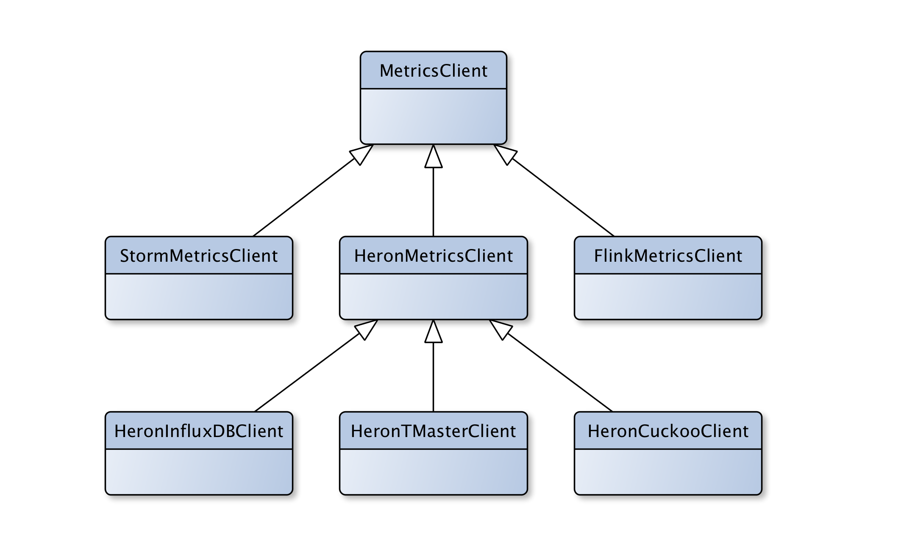

[//]: # (This document is written in Pandoc Markdown format)

# Introduction

This is the design document for the Distributed Stream Processing System (DSPS)
Topology modelling service *Caladrius*^[This is the Roman name for the legend
of the healing bird that takes sickness into itself, the ancient Greek version
of this is *Dhalion*]. The aim of this service is to accept a physical plan (a
mapping of component instances to logical containers --- called a packing plan
in Heron) for a stream processing topology and use metrics from that running
topology to predict its performance if it were to be configured according to
the proposed plan.

Caladrius will also provide other modelling service such as traffic prediction
(arrival rate into a topology) and can be extended to provide other analyses of
topology layout and performance.

# System Overview {#sec:system-overview}

The proposed layout for the system is shown below in @fig:system-overview:

{#fig:system-overview}

# Caladrius API {#sec:api}

Caladrius will provide several REST endpoints to allow clients to query the
various modelling systems it provides. Initially Caladrius will provide
topology performance (end-to-end/complete latency, throughput etc) and traffic
(incoming workload) modelling services. Other services such as topology graph
analysis could be added later.

The general format of the Caladrius end points is: `/model/<aspect being
modelled>/<DSPS name>/<current or proposed>/<topology id>`. Examples endpoints
are given below:

## Topology Performance

* `POST /model/topology/heron/proposed/{topology-id}` --- This request will
  model the proposed packing plan which is contained within the `POST`
  request's body. The payload should be the protobuf serialised [packing 
  plan](https://github.com/apache/incubator-heron/blob/master/heron/proto/packing_plan.proto)
  message issued by Heron. 

* `POST /model/topology/storm/proposed/{topology-id}` --- This request will
  model the proposed physical plan which is contained within the POST request's
  body. The payload should be the serialised WorkerSlots^[Alternatively we
  could define a protocol buffer or JSON schema for Storm packing plans] from
  the Storm Scheduler instance handling the rebalance commands. 

* `GET /model/topology/heron/current/{topology-id}` --- Issuing this request
  will model the performance of the currently deployed physical plan of the
  specified Heron topology using the supplied traffic rate (input into the
  topology). The traffic rate *for each instance* of a given spout can be
  supplied as a single value (tuples per second) mapped to the spout component
  name. The example below would tell Caladrius to predict the performance for
  the currently running topology `wordCount1` if each of the instances of the
  `sentenceSpout` spout component were emitting 150 tuples every second:

    ```
    GET /model/topology/heron/current/wordCount1?sentenceSpout=150
    ```

    If a spout is not given in the request but is present in the specified
    topology then the API will return `400` bad request to the client.
    Alternatively, individual traffic rates for each spout instance can be
    supplied by using their `TaskID`s as keys:
        
    ```
    GET /model/topology/heron/current/wordCount1?10=141&11=154&12=149
    ```

    Similarly if an instance is missed then `400` bad request will be returned. 

* `GET /model/topology/storm/current/{topology-id}` --- Issuing this request
  will model the performance of the currently deployed physical plan of the
  specified Apache Storm topology using the supplied traffic rate (input into
  the topology). The traffic rate *for each executor* of a given spout can be
  supplied as a single value (tuples per second) mapped to the spout component
  name. Alternatively, individual traffic rates for each spout executor can be
  supplied by using their `TaskID` ranges as keys:

    ```
    GET /model/topology/storm/current/wordCount1?sentenceSpout=150
    ```
       
    ```
    GET /model/topology/storm/current/wordCount1?10-12=141&13-15=154&16-18=149
    ```

### Asynchronous request/response

It is important to consider that a call to the topology modelling endpoints may
incur a significant wait (up to several seconds, depending on the modelling
logic). Therefore it seems prudent to design the API to be asynchronous,
allowing the client to continue with other operations while the modelling is
completed. Also, having an asynchronous API also means that making the
calculation pipeline, on the server side, run concurrently should be easier.

A call to the modelling endpoints will return a reference code (`model_id`) for
the proposed physical plan being calculated^[How this model ID value is
calculated is an open issue at the moment. Ideally two separately supplied
proposed physical plans, that happen to be equivalent in layout, would produce
the same model ID. This implies some kind of comparison or hashing function
that can compare proposed physical plans. Initially every submission will
produce a unique ID]. The client can then send a GET request to the original
request URL, with the model ID as a parameter, to see if the calculation in
complete. If it is not the client will receive a "pending" response, when the
calculation is complete the JSON modelling results will posted at that URL.
This also has the advantage of providing clients with a way to query past
modelling runs and recover from client failures without re-running the
calculations. An example query is given below:

``` 
POST /model/topology/heron/proposed/WordCount1

RESPONSE 202 {model_id : 1234}

GET /model/topology/heron/WordCount1?model_id=1234
```

### Response

The response format from the topology performance modelling API will contain
the results of the performance prediction for the provided packing plan. The
response will be a JSON formatted string containing the results of the
modelling. The type of results listed will vary by model implementation. By
default the endpoint will run every model implementation defined in the
configuration file (see @sec:config) and concatenate the results into a single
JSON response.

Certain fields will be common to all returned JSON objects:

* Model ID number
* Topology ID string
* List of modelling results. Each of which will have:
    - Model name 
    - Time taken to calculate the results
    - List of metric prediction results. Each of which will have:
        + A units field showing the unit of measurement for this metric
        + A prediction of mean for this metric
        + A prediction of the expected maximum value for this metric
        + A prediction of the expected minimum value for this metric

An example JSON return is shown below:

```json
{
    'model_id' : 1234
    'topology_id': 'WordCount1',
    'model_results': [
        {
            'model_name': 'Queuing Theory',
            'calculation_time' : 2.5,
            'results' : {
                'latency' : {
                    'units' : 'ms'
                    'mean' : 124.25
                    'max' : 356.24
                    'min' : 95.56
                }
                'throughput' : {
                    'units' : 'tps'
                    'mean' : 1024
                    'max' : 2096
                    'min' : 256
                }
            }
        }, 
        {
            'model_name': 'Gaussian Process Regression',
            'calculation_time' : 4.5,
            'results' : {
                'latency' : {
                    'units' : 'ms'
                    'mean' : 124.25
                    'max' : 356.24
                    'min' : 95.56
                }
                'throughput' : {
                    'units' : 'tps'
                    'mean' : 1024
                    'max' : 2096
                    'min' : 256
                }
            }
        }
    ]
}
```

## Traffic Prediction

### Request

* `GET /model/traffic/<heron or storm>/{topology-id}` --- Issuing this request
  will trigger a prediction of the expected traffic for the supplied Heron or
  Storm topology. Parameters include `duration` which indicates how much time
  in the future the traffic prediction should cover. As well as duration,
  a `units` parameter can be passed which can be `h`,`m` or `s` (for hours,
  minuets or seconds). If no no unit parameter is supplied the value of
  duration is assumed to be in minutes. The example below is asking for
  a prediction of incoming traffic into the Heron `WordCount1` topology over
  the next 2 hours:

       ```
        GET /model/traffic/heron/WordCount1?duration=2&units=h
       ```

### Response

The response format for the traffic predictions will vary according to the
implementation of the `TrafficModel` interface. However, certain key summary
statistics will be included in all responses:

* Model ID number
* Topology ID string
* The duration of the prediction period for this traffic prediction
* List of modelling results. Each of which will have:
    - Model name 
    - Time taken to calculate the results
    - List of metric prediction results. Each of which will have:
        + A units field showing the unit of measurement for this metric
        + A prediction of mean for this metric
        + A prediction of the expected maximum value for this metric
        + A prediction of the expected minimum value for this metric

An example JSON return is shown below:

```json
{
    'model_id' : 1234
    'topology_id': 'WordCount1',
    'prediction_duration' : 120,
    'model_results': [
        {
            'model_name': 'average',
            'calculation_time' : 2.5,
            'results' : {
                'arrival_rate': {
                    'mean' : 150 
                    'max' : 323,
                    'min' : 102
                }
            }
        }, 
        {
            'model_name': 'DLM',
            'calculation_time' : 5.5,
            'results' : {
                'arrival_rate': {
                    'mean' : 167 
                    'max' : 478,
                    'min' : 98
                }
            }
        }
    ]
}
```

# Model Interface

All models used in Caladrius will inherit from the abstract base `Model` class.
This simply defines the arguments all model constructors will receive, namely
the model's name (this will be used in all results returned by this model), the
configuration object (see @sec:config) and the Metrics (see @sec:metrics) and
Graph (see @sec:graph) interfaces. @fig:model-classes shows the class
hierarchy for the models:

{#fig:model-classes}

```python
class Model(ABC):

    def __init__(self, name: str, config: Config, metrics: MetricsClient,
                 graph: GraphClient) -> None:
        self.name: str = name
        self.config: Config = config
        self.metrics: MetricsClient = metrics
        self.graph: GraphClient = graph
```

## Topology Performance Modelling Interface {#sec:topo-performance}

Caladrius will be able to run one or more models against the proposed
physical/packing plan(s). Each instance of the model interface will accept the
Metrics (see @sec:metrics) and Graph (see @sec:graph) interfaces and will use
their custom code to calculate the expected performance. The `TopologyModel`
interface is shown below:

```python
class TopologyModel(Model):
    """ Abstract base class for all topology performance modelling classes """

    @abstractmethod
    def predict_performance(self, topology_id: str,
                            proposed_plan: Any) -> dict:
        """ Predicts the performance of the specified topology when configured
        according to the proposed physical plan.

        Arguments:
            topology_id (str):  The identification string for the topology
                                whose performance will be predicted.
            proposed_plan:  A data structure containing the proposed physical
                            plan.

        Returns:
            A dictionary (suitable for conversion to JSON) containing the
            performance prediction.
        """
        pass
```

## Traffic Modelling Interface {#sec:traffic}

Similar to the topology performance modelling interface (see
@sec:topo-performance), there is an abstract base class for predicting traffic
into the topologies:

```python
class TrafficModel(Model):
    """ Abstract base class for all traffic modelling classes """

    @abstractmethod
    def predict_traffic(self, topology_id: str, duration: int) -> dict:
        """ Predicts the expected traffic arriving at the specified topology
        over the period defined by the duration argument.

        Arguments:
            topology_id (str):  The identification string for the topology
                                whose traffic will be predicted.
            duration (int): The number of minuets over which to summarise the
                            traffic predictions. For example duration = 120
                            would equate to "predict the traffic over the next
                            two hours".

        Returns:
            A dictionary (suitable for conversion to JSON) containing the
            traffic prediction.
        """
        pass
```

At its simplest a concrete implementation of traffic model could take the
arrival rate into the specified topology over the last hour and return an
average as the prediction for the next hour. Of course more sophisticated time
series analysis methods could be employed by implementing a new `TrafficModel`
and adding it to the appropriate class list in the configuration file (see
@sec:config).

# Metrics Interface {#sec:metrics}

The Metrics interface will provide methods for accessing and summarising
performance metrics from a given metrics source. For example concrete
implementations could allow metrics to be extracted from the Heron Topology
Master metrics API or the Cuckoo timeseries database.

There is a master `MetricsClient` abstract base class which is the superclass
for each of the DSPS metric client interfaces: `HeronMetricsClient`,
`StormMetricsClient` etc. The DSPS metric client interfaces define the methods
required to model topologies and traffic for each of the supported DSPSs.
@Fig:metric-classes show an example of the metric class hierarchy. 

{#fig:metric-classes}

The class to be used for the metrics and other client interfaces is specified
in the configuration file as are the implementation specific configuration
options for those classes (see @sec:config).

# Graph Interface {#sec:graph}

Topologies can be represented as directed graphs^[As an aside, it is often said
that Storm/Heron topologies are Directed Acyclic Graphs (DAGs), this is not
correct. It is perfectly possible to have a downstream bolt connect back to an
upstream bolt thereby forming a cycle. However, while possible, it is rare. But
many Machine Learning algorithms incorporate feedback loops so we should avoid
using DAG to describe topologies]. Many of the possible modelling techniques
for topology performance involve analysing these graphs. Caladrius provides
a graph database interface where topology logical and physical plans can be
uploaded and used for performance analysis. 

The graph interface is based on [Apache
TinkerPop](http://tinkerpop.apache.org/), which is an abstraction layer over
several popular graph databases. This means that the graph database back-end
can be changed if needed (to better serve the needs of a particular model)
without having to reimplement the graph interface code.

Caladrius will provide classes for accessing logical and physical plan
information from the DSPS Information APIs and convert this via
TinkerPop/Gremlin code into directed graph representations. It will also
provide a `graph.prediction` interface for estimating properties of proposed
physical plans.

Again the Graph Client implementations can be set via the configuration files
along with implementation specific configuration options (see @sec:config).

# Configuration Files {#sec:config}

Caladrius will be highly configurable^[I am still figuring out the best way to
implement the configuration of each of the model and client classes], all the
modelling, metrics and graph processing code can be specified via YAML files in
the `/config` directory. 

At service start up the `/config` directory is parsed into a `Config` object
that contains all the configuration keys for Caladrius.

Each of the modelling end points (see @sec:api) can specify multiple modelling
implementations that can be run for each request. Each of the specified model
classes for each endpoint is loaded dynamically as the API is created and
passed to the appropriate API Resource.

Each of the DSPSs supported by Caladrius has its configuration values in
a separate file, an example of the `config/heron.yaml` is shown below:

```yaml
# Configuration File for the heron specific modelling endpoints

# Paths to Python classes should be absolute to avoid import errors

# Heron tracker service base URL
heron.tracker.url: 'http://localhost:1234'

# Address of external metrics database
heron.metrics.database.url: 'http://localhost:1234'

# List of Heron traffic models
model.traffic.heron:
    - 'caladrius.model.traffic.heron.dummy_traffic.DummyTrafficModel'

# List of Heron topology performance models for currently deployed topologies
# with different arrival rates
model.topology.heron.current:
    - 'caladrius.model.topology.heron.CurrentTopologyModel'

# List of Heron topology performance models for modelling the performance of
# proposed packing plans
model.topology.heron.proposed:
    - 'caladrius.model.topology.heron.QueuingTheoryModel'
```

A copy of the configuration object is passed to all Model implementations so
configuration options specific to an implementation can be added to the
configuration files and will be available at run time.

# Planned work

The design above represents a final vision for the Caladrius system. With
limited time available certain features will need to be prioritised. Below is
a plan for the implementation of a minimum viable test system:

1) Week commencing 9th April:
    - Finish design document
    - Complete Cuckoo and Heron TMaster metrics interfaces

2) Week commencing 16th April:

3) Week commencing 23rd April:

4) Week commencing 30th April:

5) Week commencing 7th May:

6) Week commencing 14th May:

7) Week commencing 21st May:

8) Week commencing 28th May:

9) Week commencing 4th June:
