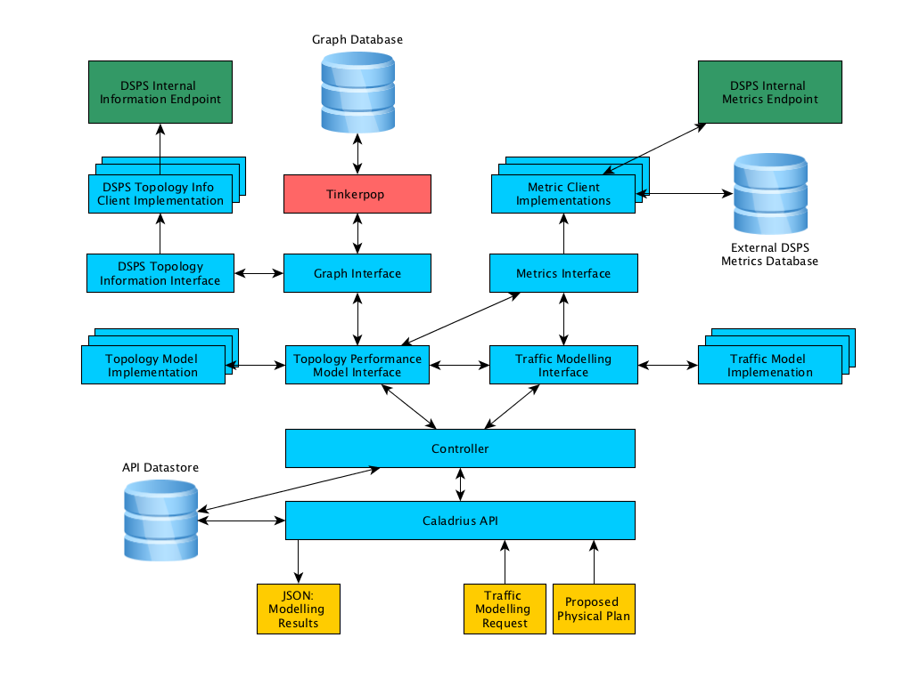

# Caladrius - Design Document

[//]: # (This document is written in Pandoc Markdown format)

[//]: # (For reference, this is the format for leaving a comment that will not
         be rendered in the output file)

## Introduction

This is the design document for the Distributed Stream Processing Topology
modelling service *Caladrius*^[This is the Roman name for the legend of the
healing bird that takes sickness into itself, the ancient Greek version of this
is called *Dhalion*]. The aim of this service is to accept a physical plan (a
mapping of component instances to logical containers --- called a packing plan
in Heron) for a topology and use metrics from that running topology to predict
its performance if it were to be configured according to the proposed plan.

## System Overview

The proposed layout for the system is shown below:



### System Operation

In order to model a proposed topology physical plan, the protocol buffer `packing_plan`
message is issued to the Caladrius API. The API then passes the plan, along
with instances of the Metrics and Graph interfaces to one or more Model
implementations^[In future which model to use could be included in the request.
For now it will just be configured on the Caladrius side].

The Model instances then use their custom code along with data provided by the
Metrics and Graph interfaces to calculate the expected performance. The results
of this modelling are then reported via a protocol buffer `modelling_results`
message^[Alternatively this could be a simple JSON message].

## Caladrius API

Caladrius exposes a REST endpoint that will accept a serialised physical
/ packing plan as part of GET message. This packing plan will be deserialised
and passed to the Controller which will process the proposed plan. Caladrius will accept requests on several different end points depending on the modelling requirements.

### Endpoints

The general format of the Caladrius end points is: 
`/model/<DSPS-Name>/<current or proposed>/`. Examples endpoints are given below:

* `POST /model/heron/proposed` 
  This will model the proposed packing plan which is contained within the POST request's body. The payload should be the protobuf serialised packing plan message issued by Heron. This message contains the Topology ID which will be used extract metrics and perform the modelling.

* `POST /model/storm/proposed` 
  This will model the proposed physical plan which is contained within the POST request's body. The payload should be the serialised WorkerSlots from the Storm Scheduler instance handling the rebalance commands.

* `GET /model/heron/current/{topology-id}`
   Issuing this request will model the currently deployed physical plan of the  
   specified topology. A `traffic` parameter is supplied which can either be a single value (tuples per second) which will be applied to every spout or individual traffic rates for each spout can be supplied by using their  `TaskID` as keys:

       ```
        GET /model/heron/current/wordcount1?traffic=150
        GET /model/heron/current/wordcount1?10=141&11=154&12=149
       ```

### Response

The response format from the API will contain the results of the performance
prediction for provided packing plan. The response will be a JSON formatted
string containing the results of the modelling. The type of results listed will
vary by model implementation.

However, certain fields will be common to all returned JSON objects:

## Model Interface

Caladrius will be able to run one or more Models against the proposed packing
plan(s). Each instance of the model interface will accept the Metrics and Graph
Interfaces (see below) and will use their custom code to calculate the expected performance.

## Metrics Interface

The Metrics interface will provide methods for accessing and summarising
performance metrics from a given metrics source. Initially implementations for
the Topology Master and Cuckoo based metrics will be provided but
implementations for the other metrics sinks could easily be created.

## Graph Interface

Topologies can be represented as directed graphs^[As an aside, it is often said
that Storm/Heron topologies are Directed Acyclic Graphs (DAGs), this is not
correct. It is perfectly possible to have a downstream bolt connect back to an
upstream bolt thereby forming a cycle. However, while possible, it is rare. But
many Machine Learning algorithms incorporate feedback loops so we should avoid
using DAG to describe topologies]. Many of the possible modelling techniques
for topology performance involve analysing these graphs. Caladrius provides a graph database interface where topology logical and physical plans can be uploaded and used for performance analysis. 

The graph interface is based on [Apache
TinkerPop](http://tinkerpop.apache.org/), which is an abstraction layer over
several popular graph databases. This means that the graph database back-end
can be changed if needed (to better serve the needs of a particular model)
without having to reimplement the graph interface code.

Caladrius will provide classes for accessing logical and physical plan information from the Heron Tracker API and converting this via TinkerPop/Gremlin code into a directed graph representations. It will also provide a graph.prediction interface for estimating properties of proposed physical plan such as instance to instance routing probabilities.

The Model implementation may then use the Graph interface to analyse these graphs.

## Language

All the main components of Caladrius will be written in Python^[Python here
refers to Python 3 not Python 2 or Legacy Python as it is now known]. The
Metric, Graph and Model interfaces will be provided via abstract base classes
so that other implementations can be provided in future.

The Caladrius API will be a REST API and so in theory could be implemented in
any language. The use of TinkerPop for the graph interface also means that the
graph databased service can be accessed in any TinkerPop supported language.

## Proposed Work Plan

The elements will implemented in the order below:

1) 
